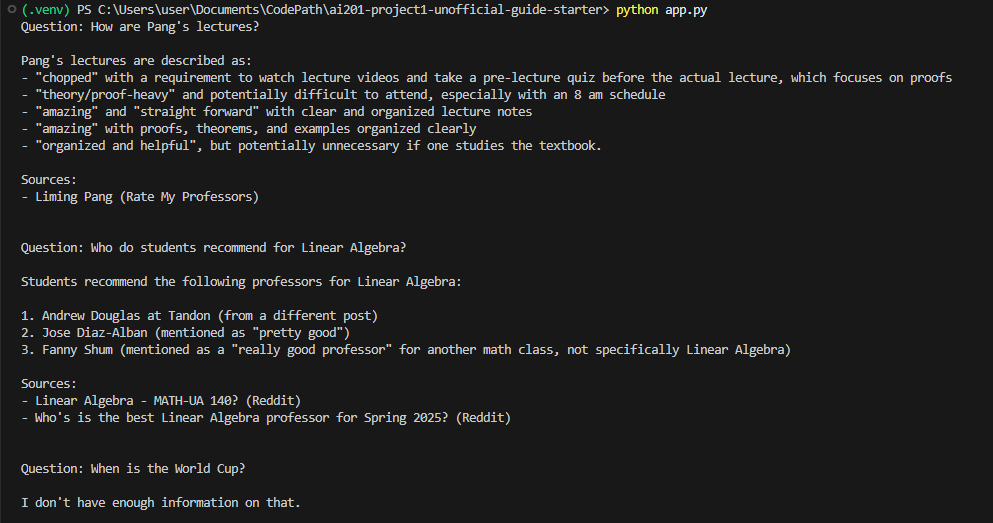

# The Unofficial Guide — Project 1

## Domain

<!-- What topic or category of knowledge does your system cover?
     Why is this knowledge valuable, and why is it hard to find through official channels?
     Example: "Student reviews of CS professors at [university] — useful because official
     course descriptions don't reflect teaching style, exam difficulty, or workload." -->

This project focuses on student experiences with mathematics professors and courses at NYU. The knowledge comes from Rate My Professors reviews online and discussions on the NYU subreddit. This information is difficult to find through official university resources because it is scattered across multiple websites and it's valuable as it relies on informal student experiences rather than published course descriptions.

---

## Document Sources

<!-- List every source you collected documents from.
     Be specific: include URLs, subreddit names, forum thread titles, or file names.
     Aim for variety — sources that together cover different subtopics or perspectives. -->

| #   | Source                                        | Type                                                                               | URL or file path                                                                             |
| --- | --------------------------------------------- | ---------------------------------------------------------------------------------- | -------------------------------------------------------------------------------------------- |
| 1   | Hesam Oveys (Rate My Professors)              | Student reviews discussing teaching style and course experience.                   | https://www.ratemyprofessors.com/professor/2228255                                           |
| 2   | Liming Pang (Rate My Professors)              | Student reviews discussing teaching style and course experience.                   | https://www.ratemyprofessors.com/professor/2291493                                           |
| 3   | John Chiarelli (Rate My Professors)           | Student reviews discussing teaching style and course experience.                   | https://www.ratemyprofessors.com/professor/2721237                                           |
| 4   | Elizabeth Stepp (Rate My Professors)          | Student reviews discussing teaching style and course experience.                   | https://www.ratemyprofessors.com/professor/1853102                                           |
| 5   | Kendall Gibson (Rate My Professors)           | Student reviews discussing teaching style and course experience.                   | https://www.ratemyprofessors.com/professor/3043706                                           |
| 6   | Fanny Shum (Rate My Professors)               | Student reviews discussing teaching style and course experience.                   | https://www.ratemyprofessors.com/professor/2260813                                           |
| 7   | Best Linear Algebra Professor (r/nyu)         | Reddit discussion comparing Linear Algebra professors.                             | https://www.reddit.com/r/nyu/comments/1gcuy12/whos_is_the_best_linear_algebra_professor_for/ |
| 8   | Calc I Professor Recommendations (r/nyu)      | Reddit discussion about Calculus I professors                                      | https://www.reddit.com/r/nyu/comments/1dc4dd5/is_there_literally_no_decently_easy_calc_1/    |
| 9   | Favorite Math Class at NYU (r/nyu)            | Reddit discussion about favorite mathematics courses and what made them enjoyable. | https://www.reddit.com/r/nyu/comments/bs6qd5/to_all_math_people_what_was_your_favorite_math/ |
| 10  | Math Electives Recommendations (r/nyu)        | Discussion of mathematics electives on Reddit.                                     | https://www.reddit.com/r/nyu/comments/1mvi4zd/math_electives/                                |
| 11  | Which Math Class Should I Take? (r/nyu)       | Advice thread about selecting maths courses                                        | https://www.reddit.com/r/nyu/comments/1d7ajo4/which_math_class_should_i_take/                |
| 12  | Linear Algebra Course Discussion (r/nyu)      | Student discussion on Linear Algebra class.                                        | https://www.reddit.com/r/nyu/comments/1402w9a/linear_algebra_mathua_140                      |
| 13  | Courant Mathematics Program Questions (r/nyu) | Discussion about the undergraduate mathematics major at NYU Courant.               | https://www.reddit.com/r/nyu/comments/ghc2b/admitted_to_nyu_for_undergraduate_mathematics/   |

---

## Chunking Strategy

<!-- Describe your chunking approach with enough specificity that someone else could reproduce it.
     Include:
     - Chunk size (characters or tokens) and why that size fits your documents
     - Overlap size and why (or why not) you used overlap
     - Any preprocessing you did before chunking (e.g., stripping HTML, removing headers)
     - What your final chunk count was across all documents -->

**Chunk size:** approximately 300 tokens (implemented using word-based token estimation)

**Overlap:** 50 tokens

Before chunking, all documents were cleaned by removing extra whitespace and normalizing text formatting. The source documents were stored in structured JSON format rather than raw HTML, so no HTML parsing or tag removal was required.

**Why these choices fit your documents:** The corpus consists primarily of short Rate My Professors reviews and Reddit discussion posts. A chunk size of 300 tokens was chosen because most reviews and comments are significantly shorter than this limit, allowing them to remain intact while still accommodating longer Reddit comments when necessary. A 50-token overlap was used to preserve context when a long review or comment had to be split across multiple chunks.

For Rate My Professors data, each review was augmented with the professor's name and source information before embedding. This was necessary because many reviews refer to the instructor only through pronouns such as "he" or "she." Including the professor name ensures that the retrieval system can associate the review with the correct instructor. For Reddit data, each comment chunk was augmented with the thread title and the original post. Reddit comments often assume that readers have already seen the discussion prompt, so including this context helps the system interpret comments that would otherwise appear ambiguous when retrieved independently.

To avoid splitting important contextual information, chunking was performed only on the raw review text (for Rate My Professors) or raw comment text (for Reddit). The added contextual fields (professor name, thread title, and original post) were treated as single units and attached after chunking. This ensures that contextual information remains complete and is never fragmented across chunk boundaries. Additionally, each Reddit original post was stored as its own chunk rather than being merged with comments. Original posts often contain the question or discussion topic that gives meaning to the subsequent replies, making them valuable retrieval targets on their own.

**Final chunk count:** 169

### Sample Chunks

#### Chunk 1 (reddit_calc1.json)

Source: Reddit

Title: Is there literally no decently easy Calc 1 professor?

Original Post:
Every post or RMP comment section says every professor is hard or difficult to get an A in 😭? Are none of them slightly easy

Comment:
My sister really really liked Selin ~ she even wanted to become a teacher for a while cause of her cause she taught really clearly. I took Silvia Espinosa, and I had to self-teach. The videos on Brightspace are extremely helpful though ~ they're like videos made by the department (each of them are only a few minutes long, but they're extremely clear), and that's what I used for the whole semester (I didn't really use any other outside resource).

#### Chunk 2 (reddit_math_class.json)

Source: Reddit

Title: Which math class should I take?

Content:
I'm an incoming Gallatin student and I'm pretty awful at math. I'd prefer to get my one math requirement out of the way while I still vaguely remember the courses I took but I only just took pre-calc this year. Any suggestions?

#### Chunk 3 (rmp_chiarelli.json)

Source: Rate My Professors

Title: John Chiarelli

Review:
You will have to teach yourself. He over complicates everything. Go on Youtube and watch The Chemistry Tutor or someone else. He gives out quizzes every day. Half the class is him doing problems of the HW, then you take a quiz and after that he teaches for 30-45 mins. The class was 1:45 mins. No formulas given on tests. Miss a class you miss a quiz

#### Chunk 4 (rmp_gibson.json)

Source: Rate My Professors

Title: Kendall Gibson

Review:
As a Professor she is not bad at all she explains the concepts in class well. However, the content on the exams and homeworks are much more difficult. I would not recommend this class if you are aiming for A's but if you are fine with a B/B+ the class is pretty attainable.

#### Chunk 5 (rmp_pang.json)

Source: Rate My Professors

Title: Liming Pang

Review:
notes are heavy but not useful

---

## Embedding Model

<!-- Name the embedding model you used and explain your choice.
     Then answer: if you were deploying this system for real users and cost wasn't a constraint,
     what tradeoffs would you weigh in choosing a different model?
     Consider: context length limits, multilingual support, accuracy on domain-specific text,
     latency, and local vs. API-hosted. -->

**Model used:** all-MiniLM-L6-v2 (via sentence-transformers)

**Top-k:** 5

**Production tradeoff reflection:**
I chose the all-MiniLM-L6-v2 model because it provides strong semantic search performance while remaining lightweight and easy to run locally. Since the corpus is relatively small and focused on a narrow domain, I initially retrieved only the top 3 most relevant chunks. However, after experimentation, I found that the model produced more rounded responses when provided with 5 most relevant chunks, while minimizing irrelevant information.

If this system were deployed for a larger audience with a significantly larger corpus, I would consider increasing the retrieval depth or using a more powerful embedding model. Larger embedding models may improve retrieval accuracy and semantic understanding, but they also increase storage requirements, inference time, and computational cost. Other considerations would include multilingual support (for instance not all reviews or discussions I encountered online were in English) and latency requirements.

### Sample Retrievals

#### SAMPLE 1

**Query:** What do students say about Hesam Oveys' exams?

================================================================================

Rank: 1
Distance: 0.2485593557357788

Source: Rate My Professors

Title: Hesam Oveys

Review:
He's a phenomenal teacher. Records all lectures, releases his notes and extra practice problems, and textbook is optional. Overall Hesam was great. You must be able to do all the problems from his notes to pass his exams. Just do the problems, and the exams aren't bad at all. They're the same problems. HW is hard too, but it's HW and not on exams.

================================================================================

Rank: 2
Distance: 0.25864720344543457

Source: Rate My Professors

Title: Hesam Oveys

Review:
Very hard exams that he does not prepare you to take. What he teaches in class is different from what is on the midterm and final despite what he may say.

================================================================================

Rank: 3
Distance: 0.2612389326095581

Source: Rate My Professors

Title: Hesam Oveys

Review:
Curves the exam well and you can find similar questions on the lectures

================================================================================

_Notes: The query relates to Hesam Oveys' exams. The retrieved chunks are relevant as they are from Hesam Oveys' Rate My Professors page and make multiple references to his exams, including the content and structure._

#### SAMPLE 2

**Query:** How is Fanny Shum's grading?

================================================================================

Rank: 1
Distance: 0.2764996290206909

Source: Rate My Professors

Title: Fanny Shum

Review:
The exams were much harder than the homework, quizzes, and examples in class. She does not explain the material thoroughly. The TAs won't help you much as they forgot most of the subject.

================================================================================

Rank: 2
Distance: 0.2966386675834656

Source: Rate My Professors
Title: Fanny Shum

Review:
Tough exams but good at explaining. Very accessible at Office Hours. She gives good curve based on individual improvement.

================================================================================

Rank: 3
Distance: 0.34812116622924805

Source: Rate My Professors
Title: Fanny Shum

Review:
Good professor, but be wary of the heavy workload. She gives 6 assignments a week so you will almost always be busy with this class. Tests are not curved individually, but there is a generous shift of ~5% on final grade if you improve over time and show up (lectures, office hours.) Overall a great professor, but you have to stay on top of work.

================================================================================

_Notes: The query relates to Fanny Shum's grading. The retrieved chunks are relevant as they are from Fanny Shum's Rate My Professors page and make multiple references to her assessments and curving of grades._

#### SAMPLE 3

**Query:** What are some recommended math classes at NYU?

================================================================================

Rank: 1
Distance: 0.31186938285827637

Source: Reddit

Title: To all math people: What was your favorite math class at NYU?

Original Post:
I really enjoyed Intro to Math Modeling taught by professor Rangan, specifically because I felt like his lectures improved my own intuition of the concepts. Analysis was up there too but because of the proofs rather than the professor. Would love to hear about what classes others have enjoyed here!

Comment:
I liked Topology II with Cappell and Honors Analysis I with Germain the most I think. Cappell mostly because of the subject, though you really have to just learn on your own because you won't cover nearly enough in class.

================================================================================

Rank: 2
Distance: 0.3219924569129944

Source: Reddit

Title: To all math people: What was your favorite math class at NYU?

Original Post:
I really enjoyed Intro to Math Modeling taught by professor Rangan, specifically because I felt like his lectures improved my own intuition of the concepts. Analysis was up there too but because of the proofs rather than the professor. Would love to hear about what classes others have enjoyed here!

Comment:
Linear Algebra is pretty challenging but also cool if you have the right professor. I had Cliona Golden and at the end of the semester, everyone gave her 5/5 for her course evaluations because she was just that good of a professor. Would def recommend.

================================================================================

Rank: 3
Distance: 0.3357306718826294

Source: Reddit

Title: To all math people: What was your favorite math class at NYU?

Original Post:
I really enjoyed Intro to Math Modeling taught by professor Rangan, specifically because I felt like his lectures improved my own intuition of the concepts. Analysis was up there too but because of the proofs rather than the professor. Would love to hear about what classes others have enjoyed here!

Comment:
(Undergrad) PDE with Sanaei; Abstract Algebra with Fengbo Hang; Functional Analysis with Guido De Philippis; Master linear algebra and analysis with Gaoyong Zhang; Applied Stochastic Analysis with Jonathan Weare; Stochastic Calculus with Alexey Kuptsov.

================================================================================

_Notes: The query relates to math classes students recommend. The retrieved chunks are relevant as they were retrieved from the Reddit post asking for favorite math classes. The comments include mutliple varying recommendations._

---

## Grounded Generation

<!-- Explain how your system enforces grounding — how does it prevent the LLM from answering
     beyond the retrieved documents?
     Describe both your system prompt (what instruction you gave the model) and any structural
     choices (e.g., how you formatted the context, whether you filtered low-relevance chunks).
     Do not just say "I told it to use the documents" — show the actual instruction or explain
     the mechanism. -->

**System prompt grounding instruction:** The system uses Groq's llama-3.3-70b-versatile model and provides it with only the top-5 retrieved chunks from ChromaDB. The prompt includes the instruction:

_Answer the user's question using ONLY the information provided in the context below. If the context does not contain enough information, respond exactly: "I don't have enough information on that." Do not use outside knowledge. Do not make assumptions._

This encourages the model to stay grounded in the retrieved documents and refuse questions that cannot be answered from the available evidence. Temperature is set to 0 to reduce randomness in generation, making the model more deterministic and less likely to deviate from the retrieved context.

**How source attribution is surfaced in the response:** Source attribution is handled programmatically. After retrieval, the system collects the titles and source types of the retrieved chunks from metadata and appends them to the response under a Sources section.

For example:

- Hesam Oveys (Rate My Professors)
- Best Linear Algebra Professor (Reddit)

If the model returns the fallback response ("I don't have enough information on that."), no sources are shown.

### Examples

---

## Evaluation Report

<!-- Run your 5 test questions from planning.md through your system and record the results.
     Be honest — a partially accurate or inaccurate result that you explain well is more
     valuable than a suspiciously perfect result. -->

| #   | Question                                                                         | Expected answer                                                                                                                        | System response (summarized)                                                                                                                                                                                                                                                                                                                                                                                                                                                                                                                                                                                                                      | Retrieval quality | Response accuracy |
| --- | -------------------------------------------------------------------------------- | -------------------------------------------------------------------------------------------------------------------------------------- | ------------------------------------------------------------------------------------------------------------------------------------------------------------------------------------------------------------------------------------------------------------------------------------------------------------------------------------------------------------------------------------------------------------------------------------------------------------------------------------------------------------------------------------------------------------------------------------------------------------------------------------------------- | ----------------- | ----------------- |
| 1   | What do students say about Hesam Oveys' exams?                                   | Students say that his exams are extremely difficult, noting that only studying his notes is not enough to pass the exam.               | Students have mixed opinions about Hesam Oveys' exams. Some say that if you do the problems from his notes, the exams aren't bad and are similar to the homework problems. One student also mentions that he curves the exam well and you can find similar questions on the lectures. However, others describe the exams as "VERY hard", "very difficult", and that what he teaches in class is different from what is on the midterm and final, despite his claims. One student even jokingly says the exams are like they came from a different planet. Sources: Hesam Oveys (Rate My Professors)                                               | Relevant          | Accurate          |
| 2   | Which Linear Algebra professors do NYU students recommend?                       | Fanny Shum and Jose Diaz-Alban are frequently recommended by NYU students.                                                             | NYU students recommend the following Linear Algebra professors: 1. Jose Diaz-Alban 2. Andrew Douglas (at Tandon) 3. Cliona Golden Sources: Linear Algebra - MATH-UA 140? (Reddit), To all math people: What was your favorite math class at NYU? (Reddit), Who's is the best Linear Algebra professor for Spring 2025? (Reddit)                                                                                                                                                                                                                                                                                                                   | Relevant          | Accurate          |
| 3   | Which Calculus I professors are recommended at NYU?                              | Professors Selin K, Feklistova and Oveys were recommended often by NYU students.                                                       | I don't have enough information on that.                                                                                                                                                                                                                                                                                                                                                                                                                                                                                                                                                                                                          | Off-target        | Accurate          |
| 4   | What do students say about the undergraduate mathematics program at NYU Courant? | Students describe Courant's applied math program as being generally very well-regarded with the professors being very easy to talk to. | One student, a freshman, says that the mathematics department is amazing, with professors who are easy to talk to and willing to give advice. They also mention that the seminars and lectures are of incredible quality and that the community is great. They recommend joining the math club. However, another student mentions that the CS department is lack-luster, but this comment is not specifically about the undergraduate mathematics program. Sources: Admitted to NYU for undergraduate mathematics - anything I should know about the Courant Institute? (Reddit)                                                                  | Relevant          | Accurate          |
| 5   | How do students describe Elizabeth Stepp's teaching style?                       | Students not that she is great at explaining concepts and will take time to make sure students questions are worked out.               | Students describe Elizabeth Stepp's teaching style as follows: One student found her explanations clear with lots of examples. Another student thought she was decent at teaching concepts. A third student stated that she explains things well and they like her lecture style of writing down notes and examples. However, other students found her notes to be confusing, disorganized, or a mess, and her explanations unclear or difficult to comprehend. One student also mentioned that she assumes prior knowledge of probability/statistics, which can be a problem for those without it. Sources: Elizabeth Stepp (Rate My Professors) | Relevant          | Accurate          |

**Retrieval quality:** Relevant / Partially relevant / Off-target  
**Response accuracy:** Accurate / Partially accurate / Inaccurate

---

## Failure Case Analysis

<!-- Identify at least one question where retrieval or generation did not work as expected.
     Write a specific explanation of *why* it failed, tied to a part of the pipeline.

     "The answer was wrong" is not an explanation.

     "The relevant information was split across a chunk boundary, so retrieval returned
     only half the context — the model didn't have enough to answer correctly" is an explanation.

     "The embedding model treated the professor's nickname as out-of-vocabulary and returned
     results from an unrelated review" is an explanation. -->

**Question that failed:** Which Calculus I professors are recommended at NYU?

**What the system returned:** I don't have enough information on that.

**Root cause (tied to a specific pipeline stage):** The dataset contains a Reddit thread titled "Is there literally no decently easy Calc 1 professor?" in which students discuss their experiences with Calculus I instructors. Because the thread title and original post contain references to "Calc 1" and "easy professors" rather than the exact wording "recommended professors," the retrieval system did not rank this document among the top results. Instead, the retriever returned several chunks from unrelated mathematics course discussions. Since the retrieved context did not contain enough information to answer the question, the language model correctly responded with: "I don't have enough information on that."

**What you would change to fix it:**: I would use a stronger embedding model, or incorporate keyword-based retrieval alongside semantic search in order to improve performance on queries that use different terminology than the source documents.

---

## Spec Reflection

<!-- Reflect on how planning.md shaped your implementation.
     Answer both questions with at least 2–3 sentences each. -->

**One way the spec helped you during implementation:** The spec was very useful for this project because there were so many moving parts that depended on the previous phase. Having the spec to refer to really helped to provide a clear outline for working on the solutions. Additionally, using the spec to prompt AI tools yielded far better results as the AI understood more clearly the progression of stages and the tools I would use at each one.

**One way your implementation diverged from the spec, and why:** I initially set the top-k as 3 becaus I figured that with a small corpus like this, retrieving too many chunks would dilute the quality of the responses as there is a risk that a chunk with a similarity score above 0.5 would be included. However, after experimenting with the data, setting top-k to 5 improved retrieval quality and the retrieved chunks were still very similar to the query.

---

## AI Usage

<!-- Describe at least 2 specific instances where you used an AI tool during this project.
     For each: what did you give the AI as input, what did it produce, and what did you
     change, override, or direct differently?

     "I used Claude to help me code" is not sufficient.
     "I gave Claude my Chunking Strategy section from planning.md and asked it to implement
     chunk_text(). It returned a function using a fixed character split. I overrode the
     chunk size from 500 to 200 because my documents are short reviews, not long guides." -->

**Instance 1**

- _What I gave the AI:_ My initial chunking strategy and document structure (Rate My Professors reviews and Reddit threads) and asked for a chunking implementation for a RAG pipeline.
- _What it produced:_ A basic sliding-window chunking function using fixed character/token limits, including overlap and splitting logic for long text.
- _What I changed or overrode:_ I modified the design to preserve structured context. Reddit original posts were kept as standalone chunks, while only comments and reviews were split. I also added metadata enrichment (professor name, thread title, source type) after chunking rather than inside the chunking function.

**Instance 2**

- _What I gave the AI:_ My retrieval and generation pipeline design, including ChromaDB setup and a requirement to implement grounded generation with source attribution.
- _What it produced:_ A working RAG pipeline using SentenceTransformer embeddings, ChromaDB for vector storage, and a prompt template instructing the model to answer only from retrieved context.
- _What I changed or overrode:_ I added a structured metadata-based filtering system for Reddit vs Rate My Professors sources, enforced a strict “no sources shown on refusal” rule, and integrated a Gradio interface for interactive querying and evaluation.

## Query Interface

The system is implemented using a Gradio web interface. It allows users to ask questions about NYU math professors and courses and optionally filter results by source type.

### Inputs

- **Question (text box):** The user’s query about professors or courses (e.g., “Which Calculus I professors are recommended at NYU?”)
- **Source Filter (dropdown):** Optional metadata filter with three options:
  - All
  - Reddit
  - Rate My Professors

### Output

- **Answer (text box):** A generated response grounded in retrieved documents. If no relevant information is found, the system returns: “I don't have enough information on that.”
- **Sources (appended text):** A list of retrieved document titles and their source types, shown only when an answer is produced.

---

### Sample Interaction

**User Input:**

> Which Calculus I professors are recommended at NYU?

**Source Filter:** All

**System Output:**

> Students report mixed experiences with Calculus I at NYU, with several Reddit discussions indicating that most professors are perceived as challenging and grading is often strict. Some students suggest that no instructor is consistently considered “easy,” and experiences vary significantly by section.

**Sources:**

- Is there literally no decently easy Calc 1 professor? (Reddit)
- Hesam Oveys (Rate My Professors)

## How to Run

1. Install dependencies and set up API key.
2. (optional) Run `python build_index.py` if vector database is empty.
3. Run `gradio_app.py`.
