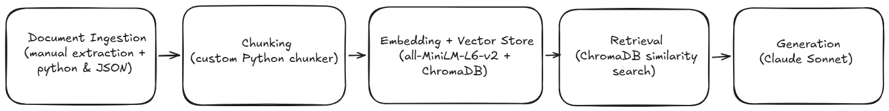

# Project 1 Planning: The Unofficial Guide

> Write this document before you write any pipeline code.
> Your spec and architecture diagram are what you'll use to direct AI tools (Claude, Copilot, etc.) to generate your implementation — the more specific they are, the more useful the generated code will be.
> Update the Retrieval Approach and Chunking Strategy sections if you change your approach during implementation.
> Update this file before starting any stretch features.

---

## Domain

<!-- What domain did you choose? Why is this knowledge valuable and hard to find through official channels? -->

This project focuses on student experiences with mathematics professors and courses at NYU. The knowledge comes from Rate My Professors reviews online and discussions on the NYU subreddit. This information is difficult to find through official university resources because it is scattered across multiple websites and it's valuable as it relies on informal student experiences rather than published course descriptions.

---

## Documents

<!-- List your specific sources: URLs, subreddit names, forum threads, or file descriptions.
     Aim for at least 10 sources that together cover different subtopics or perspectives within your domain. -->

| #   | Source                                        | Description                                                                        | URL or location                                                                              |
| --- | --------------------------------------------- | ---------------------------------------------------------------------------------- | -------------------------------------------------------------------------------------------- |
| 1   | Hesam Oveys (Rate My Professors)              | Student reviews discussing teaching style and course experience.                   | https://www.ratemyprofessors.com/professor/2228255                                           |
| 2   | Liming Pang (Rate My Professors)              | Student reviews discussing teaching style and course experience.                   | https://www.ratemyprofessors.com/professor/2291493                                           |
| 3   | John Chiarelli (Rate My Professors)           | Student reviews discussing teaching style and course experience.                   | https://www.ratemyprofessors.com/professor/2721237                                           |
| 4   | Elizabeth Stepp (Rate My Professors)          | Student reviews discussing teaching style and course experience.                   | https://www.ratemyprofessors.com/professor/1853102                                           |
| 5   | Kendall Gibson (Rate My Professors)           | Student reviews discussing teaching style and course experience.                   | https://www.ratemyprofessors.com/professor/3043706                                           |
| 6   | Fanny Shum (Rate My Professors)               | Student reviews discussing teaching style and course experience.                   | https://www.ratemyprofessors.com/professor/2260813                                           |
| 7   | Best Linear Algebra Professor (r/nyu)         | Reddit discussion comparing Linear Algebra professors.                             | https://www.reddit.com/r/nyu/comments/1gcuy12/whos_is_the_best_linear_algebra_professor_for/ |
| 8   | Calc I Professor Recommendations (r/nyu)      | Reddit discussion about Calculus I professors                                      | https://www.reddit.com/r/nyu/comments/1dc4dd5/is_there_literally_no_decently_easy_calc_1/    |
| 9   | Favorite Math Class at NYU (r/nyu)            | Reddit discussion about favorite mathematics courses and what made them enjoyable. | https://www.reddit.com/r/nyu/comments/bs6qd5/to_all_math_people_what_was_your_favorite_math/ |
| 10  | Math Electives Recommendations (r/nyu)        | Discussion of mathematics electives on Reddit.                                     | https://www.reddit.com/r/nyu/comments/1mvi4zd/math_electives/                                |
| 11  | Which Math Class Should I Take? (r/nyu)       | Advice thread about selecting maths courses                                        | https://www.reddit.com/r/nyu/comments/1d7ajo4/which_math_class_should_i_take/                |
| 12  | Linear Algebra Course Discussion (r/nyu)      | Student discussion on Linear Algebra class.                                        | https://www.reddit.com/r/nyu/comments/1402w9a/linear_algebra_mathua_140                      |
| 13  | Courant Mathematics Program Questions (r/nyu) | Discussion about the undergraduate mathematics major at NYU Courant.               | https://www.reddit.com/r/nyu/comments/ghc2b/admitted_to_nyu_for_undergraduate_mathematics/   |

---

## Chunking Strategy

<!-- How will you split documents into chunks?
     State your chunk size (in tokens or characters), overlap size, and explain why those
     numbers fit the structure of your documents.
     A review-heavy corpus warrants different chunking than a long FAQ. -->

**Chunk size:** 300 tokens

**Overlap:** 50 tokens

**Reasoning:** The corpus contains two main types of documents: Rate My Professors reviews and Reddit discussion threads. Since Rate My Professors reviews are typically short and focused on a single student experience, each review will be treated as its own chunk. Similarly, Reddit comments often contain a single opinion or recommendation and will be treated as individual chunks whenever possible.

For unusually long Reddit posts or comments that exceed 300 tokens, a sliding-window chunking strategy will be applied with a chunk size of 300 tokens and an overlap of 50 tokens. The overlap helps preserve context when information appears near chunk boundaries.

---

## Retrieval Approach

<!-- Which embedding model are you using (e.g., all-MiniLM-L6-v2 via sentence-transformers)?
     How many chunks will you retrieve per query (top-k)?
     If you were deploying this for real users and cost wasn't a constraint, what tradeoffs
     would you weigh in choosing a different embedding model — context length, multilingual
     support, accuracy on domain-specific text, latency? -->

**Embedding model:** all-MiniLM-L6-v2 (via sentence-transformers)

**Top-k:** 3

**Production tradeoff reflection:**
I chose the all-MiniLM-L6-v2 model because it provides strong semantic search performance while remaining lightweight and easy to run locally. Since the corpus is relatively small and focused on a narrow domain, retrieving the top 3 most relevant chunks should provide enough context to answer most questions while minimizing irrelevant information.

If this system were deployed for a larger audience with a significantly larger corpus, I would consider increasing the retrieval depth or using a more powerful embedding model. Larger embedding models may improve retrieval accuracy and semantic understanding, but they also increase storage requirements, inference time, and computational cost. Other considerations would include multilingual support (for instance not all reviews or discussions I encountered online were in English) and latency requirements.

---

## Evaluation Plan

<!-- List your 5 test questions with their expected correct answers.
     Questions should be specific enough that you can judge whether the system's response
     is right or wrong. "What are good dining halls?" is too vague.
     "What do students say about wait times at [dining hall name] during lunch?" is testable. -->

| #   | Question                                                                         | Expected answer                                                                                                                        |
| --- | -------------------------------------------------------------------------------- | -------------------------------------------------------------------------------------------------------------------------------------- |
| 1   | What do students say about Hesam Oveys' exams?                                   | Students say that his exams are extremely difficult, noting that only studying his notes is not enough to pass the exam.               |
| 2   | Which Linear Algebra professors do NYU students recommend?                       | Fanny Shum and Jose Diaz-Alban are frequently recommended by NYU students.                                                             |
| 3   | Which Calculus I professors are recommended at NYU?                              | Professors Selin K, Feklistova and Oveys were recommended often by NYU students.                                                       |
| 4   | What do students say about the undergraduate mathematics program at NYU Courant? | Students describe Courant's applied math program as being generally very well-regarded with the professors being very easy to talk to. |
| 5   | How do students describe Elizabeth Stepp's teaching style?                       | Students not that she is great at explaining concepts and will take time to make sure students questions are worked out.               |

---

## Anticipated Challenges

<!-- What could go wrong? Name at least two specific risks with reasoning.
     Consider: noisy or inconsistent documents, missing source attribution, off-topic
     retrieval, chunks that split key information across boundaries. -->

1. Student reviews about the same professor may be conflicting as they may have had different experiences. It would be difficult for the system to generate a single definitive answer in those instances.

2. Reddit comments often include discussions that may not be relevant to the original poster's question. These side-commennts could be retrieved, reducing response quality.

---

## Architecture

<!-- Draw a diagram of your pipeline showing the five stages:
     Document Ingestion → Chunking → Embedding + Vector Store → Retrieval → Generation
     Label each stage with the tool or library you're using.
     You can use ASCII art, a Mermaid diagram, or embed a sketch as an image.
     You'll use this diagram as context when prompting AI tools to implement each stage. -->

## 

## AI Tool Plan

<!-- For each part of the pipeline below, describe:
     - Which AI tool you plan to use (Claude, Copilot, ChatGPT, etc.)
     - What you'll give it as input (which sections of this planning.md, which requirements)
     - What you expect it to produce
     - How you'll verify the output matches your spec

     "I'll use AI to help me code" is not a plan.
     "I'll give Claude my Chunking Strategy section and ask it to implement chunk_text()
     with my specified chunk size and overlap" is a plan. -->

**Milestone 3 — Ingestion and chunking:** I will use Claude to generate code to load the documents, parse them and split chunks according to the chunking strategy I specified above.

**Milestone 4 — Embedding and retrieval:** I will use Claude to generate code that creates embeddings using the all-MiniLM-L6-v2 model and stores them in a vector index. I will provide the AI tool with the Retrieval Approach section and ask for retrieval code that returns the top 3 most relevant chunks (and I will then verify the implementation by testing the evaluation questions and inspecting retrieved chunks manually).

**Milestone 5 — Generation and interface:** I will use Claude to generate code that combines retrieved chunks with the user query and passes them to a language model to generate answers. I will provide the Evaluation Plan and ask for a simple interface that displays the generated response and source information. At this stage, I will manually verify that answers remain grounded in retrieved content and that sources are attributed and displayed properly.
